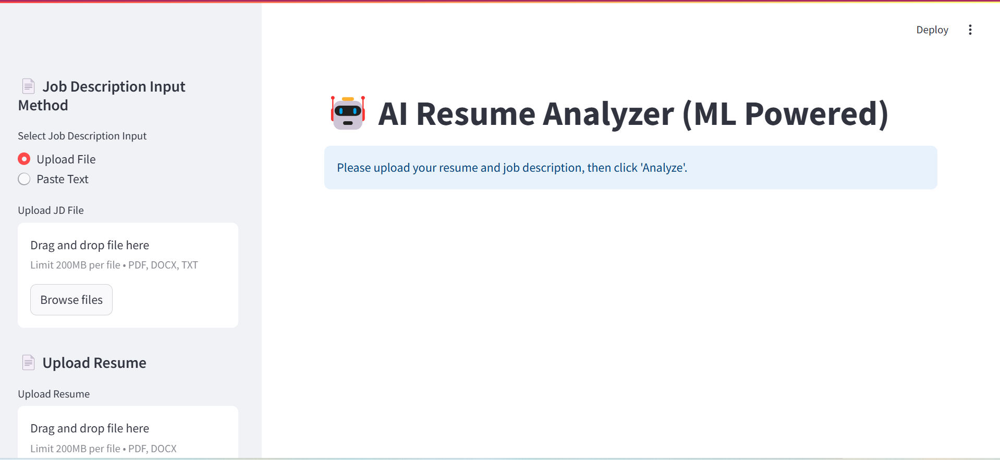
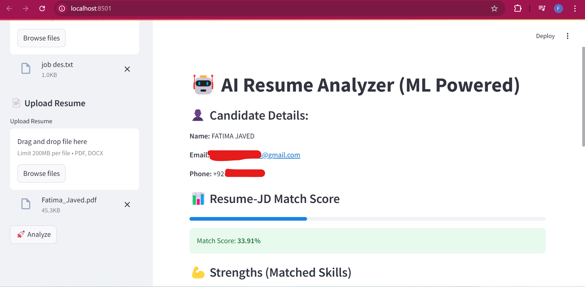
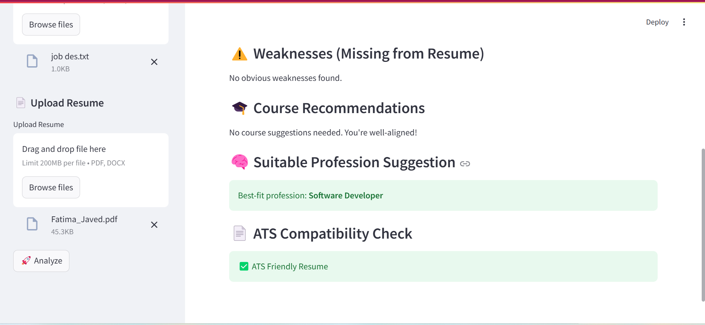

# 🤖 Resume Scanner AI

A smart resume analyzer that matches a candidate’s resume with a job description, extracts useful information, evaluates compatibility, and suggests improvements using AI.

---

## 📌 Features

- 📄 Upload resume (PDF/DOC) and job description
- 🧠 Extracts:
  - Name, email, phone number
  - Skills and strengths
  - Weaknesses and areas to improve
- 📊 Provides:
  - Job-resume match percentage
  - Course recommendations
  - Suitable career suggestions
  - ATS (Applicant Tracking System) compatibility feedback

---

## 🧠 How It Works

1. Upload the candidate’s resume and job description.
2. AI/NLP processes the content:
   - Extracts structured data
   - Compares skill alignment and keyword overlap
   - Uses heuristics and LLM models for analysis
3. Displays:
   - Profile summary
   - Job match score
   - Recommendations

---

## 📸 Screenshots
## 📸 Screenshots

### 🖥️ Home Interface


### 📄 Resume Upload


### 📊 Results Page


---

## 🚀 How to Run

```bash
# Clone this repo
git clone https://github.com/fatimajaved444/Resume_Analyzer.git
cd Resume_Analyzer

# Install dependencies
pip install -r requirements.txt

# Run the app (if using Streamlit)
streamlit run app.py
